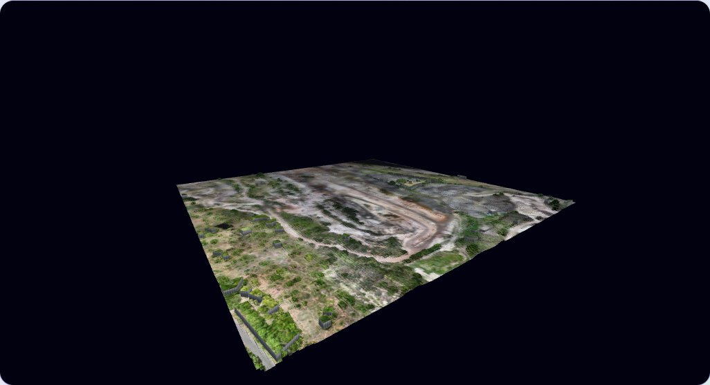
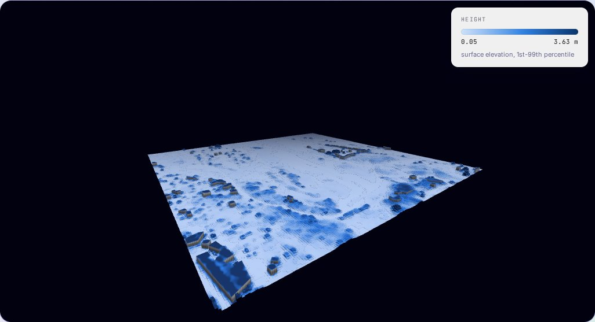
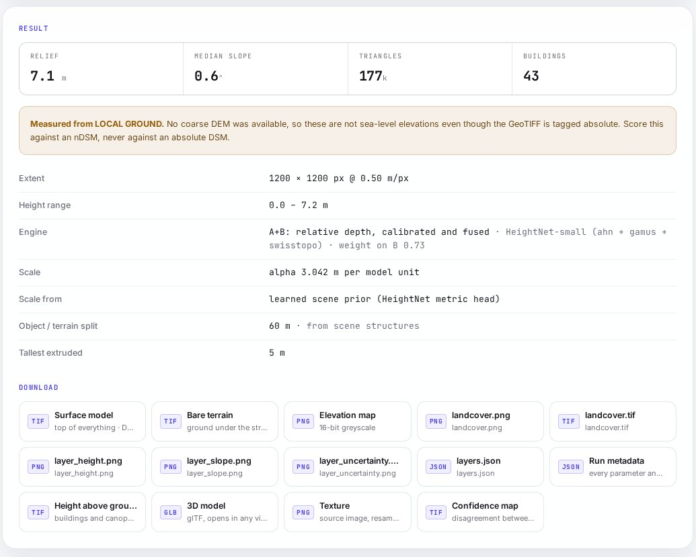

# <p align="center"> DepthWizard</p>
<h2 align="center">Single-View Height Estimation and 3D Flythrough</h2>
<p align="center">One optical satellite or aerial image in. A Digital Surface Model in metres and a 3D city you can fly through out.<br/>No stereo pair, no LiDAR, no radar.</p>
<hr>
<h2 align="center">TEAM ALGOHOLIC1 : Smart India Hackathon 2026 (SIH 2026)</h2>


<h2 align="center">COMPLETE DESCRIPTION</h2>

### PS ID : SIH26175

### Team ID : 175991

### Organisation : Indian Space Research Organisation (ISRO), Department of Space

### Theme : Disaster Management &nbsp;·&nbsp; Category : Software

### PS Title :
Single-View Height Estimation and 3D Flythrough

### PS Description :
Accurate Digital Elevation Models (DEMs) and Digital Surface Models (DSMs) are fundamental to urban planning, disaster management and reconnaissance. Traditionally they come from stereo pairs, LiDAR or InSAR, which are costly, need special sensors and take time. The task is to build an end-to-end pipeline that turns a single optical RGB remote-sensing image into an elevation map:

1. **Non-georeferenced images (PNG / JPG):** produce a Relative DSM (rDSM).
2. **Georeferenced images (GeoTIFF):** produce an Absolute DSM with metric heights, using a pre-trained monocular depth model plus a low-resolution DEM (e.g. SRTM 30 m) or a few Ground Control Points for scale.
3. **Visualization:** drape the image on a 3D terrain mesh and let users fly through it, measure heights and slopes, and validate against reference data, in a standalone application.

Evaluation: DSM accuracy (RMSE, MAE, correlation vs LiDAR across urban, sparse, hilly and forest land) 50% · rendering quality and user experience 50%.

### Idea Title :
DepthWizard: a single-image 3D elevation platform with measured, not claimed, accuracy.

### Idea Description :
A depth model can only **rank** heights. It says "this roof is higher than that street", never "this roof is 31 m". DepthWizard turns that ranking into metres and then into a city you can walk through:

1. **Fine-tuned depth.** Depth Anything V2, fine-tuned on the GAMUS dataset and Dutch/Swiss LiDAR (HeightNet), so it understands top-down imagery.
2. **Rotation ensemble.** The image is predicted at 0°, 90°, 180° and 270° and averaged. The model's fake tilt, learned from street-level photos, cancels out, and the disagreement between passes gives a free per-pixel confidence map.
3. **Scale calibration.** Relative depth becomes metres from a learned scene prior, a known height, Ground Control Points, shadow lengths, or the GHSL building-height grid.
4. **Terrain fusion.** Copernicus GLO-30 DEM supplies the ground; the image supplies buildings and trees on top, giving a DSM in metres above sea level.
5. **3D city.** Buildings are extruded with flat roofs and vertical walls, textured with the original image, and exported as glTF.
6. **Flythrough and analysis.** Fly, walk at 1:1 scale or use VR; click to measure height, slope and elevation profiles; switch between height, slope and uncertainty layers.
7. **Built-in validation.** Drop in a reference LiDAR raster and get RMSE, MAE and correlation, split by landscape type.

### Status :
Everything above is implemented and running:

1. PNG/JPG → relative DSM, and GeoTIFF → absolute DSM, DTM and nDSM as georeferenced GeoTIFFs.
2. Four engines: zero-shot, fine-tuned, direct metric, and the default hybrid that fuses them.
3. React + three.js viewer with fly / walk / VR modes, click-to-measure, elevation profiles and analysis layers.
4. FastAPI backend with background jobs, progress, downloads and a LiDAR validation endpoint.
5. Runs on a laptop CPU, offline after the first run (cached model and DEMs), or as one Docker container.
6. LiDAR benchmark harness plus regression tests, a full-pipeline self-test and a training self-test.


| 3D flythrough (photo texture) | Height layer draped on the same mesh |
|---|---|
|  |  |

### Accuracy (measured against LiDAR) :
9 scenes from AHN4 (Netherlands) and swissSURFACE3D (Switzerland), 0.5 m, covering urban, sparse, hilly and forest land. No training tile lies within 3 km of a benchmark scene.

| Engine | RMSE (raw) | MAE | Correlation r | Urban | Sparse | Hilly | Forest |
|---|--:|--:|--:|--:|--:|--:|--:|
| Zero-shot Depth Anything V2 + one known height | 5.37 m | 3.45 m | 0.78 | 6.20 | 3.73 | 4.41 | 7.55 |
| **DepthWizard hybrid, fully automatic** | **4.91 m** | **2.49 m** | **0.84** | 5.06 | 4.08 | 3.20 | 6.18 |

Landscape columns are RMSE in metres. RMSE (raw) is on the untouched output, with no vertical datum shift. How to reproduce: [`mathsandml/benchmark/BENCHMARK.md`](mathsandml/benchmark/BENCHMARK.md).



### Tech Stacks Used :
⦿ <b>AI / ML :</b>
* [](https://www.python.org/)
  [](https://pytorch.org/)
  [](https://depth-anything-v2.github.io/)
  [](https://opencv.org/)
  [](https://numpy.org/)
  [](https://scipy.org/)

⦿ <b>Geospatial & 3D :</b>
* [](https://rasterio.readthedocs.io/)
  [](https://trimesh.org/)
  [](https://portal.opentopography.org/datasetMetadata?otCollectionID=OT.032021.4326.1)

⦿ <b>BackEnd :</b>
* [](https://fastapi.tiangolo.com/)

⦿ <b>FrontEnd :</b>
* [](https://react.dev/)
  [](https://threejs.org/)
  [](https://vitejs.dev/)

⦿ <b>Deployment :</b>
* [](https://www.docker.com/)
  [](https://railway.app/)

### Important URLS :
⭐️ <b>Live Prototype :</b> [depthwizard-production-09d9.up.railway.app](https://depthwizard-production-09d9.up.railway.app/)
Drop any aerial or satellite image (PNG, JPG or GeoTIFF), or try the Indian demo scene in [`demo/`](demo/).

⭐️ <b>SIH Idea PPT :</b> _add the Canva / Drive link here_

⭐️ <b>Demo Video :</b> _add the YouTube link here_

⭐️ <b>Technical documentation :</b> [docs/TECHNICAL.md](docs/TECHNICAL.md) · [Training guide](training/TRAINING.md) · [Benchmark guide](mathsandml/benchmark/BENCHMARK.md)

---

## Project Created & Maintained By

## :heart: Team Algoholic1
1. [Garv Bansal](https://github.com/garv-bansal)
2. [Arpit Parashar](https://github.com/arpitparashar06)
3. [Arpit Jain](https://github.com/arpitjain0214-pixel)
4. Bhavdeep Singh
5. Devanshi Yadav
6. Manya Tyagi

### How-to-run

**One double-click (recommended)**
- Install [Python 3.10+](https://www.python.org/downloads/) (if not installed).
- Clone this repository.
- Run `start.command` on macOS, `start.bat` on Windows, or `./start.sh` on Linux.
- The first run creates `.venv`, installs the requirements and downloads the depth model once. After that it starts in seconds and opens http://127.0.0.1:8000.

**Docker**
```bash
docker build -t depthwizard .
docker run -p 8000:8000 depthwizard
```

**Command line, no browser**
```bash
python backend/run_geotiff.py demo/india_andhra.tif --tallest 15
```

**Optional:** put a free [OpenTopography](https://portal.opentopography.org/) API key in `.env` as `OPENTOPO_KEY=...` to get heights in metres above sea level. Without it, heights are measured from local ground.

**Tests**
```bash
python mathsandml/benchmark/tests.py
python mathsandml/test_invariants.py
python training/selftest.py
```

## References
1. Yang et al., "Depth Anything V2," NeurIPS 2024. [arXiv](https://arxiv.org/abs/2406.09414)
2. Xiong et al., "GAMUS: A Geometry-aware Multi-modal Semantic Segmentation Benchmark for Remote Sensing Data," arXiv 2023. [arXiv](https://arxiv.org/abs/2305.14914) · [dataset](https://huggingface.co/datasets/earthflow/GAMUS)
3. Chen et al., "HTC-DC Net: Monocular Height Estimation from Single Remote Sensing Images," IEEE TGRS 2023. [DOI](https://doi.org/10.1109/TGRS.2023.3321255)
4. Mou & Zhu, "IM2HEIGHT: Height Estimation from Single Monocular Imagery," 2018. [arXiv](https://arxiv.org/abs/1802.10249)
5. He, Sun & Tang, "Guided Image Filtering," IEEE TPAMI 2013. [IEEE](https://ieeexplore.ieee.org/document/6319316)

Data: Copernicus GLO-30 DEM via OpenTopography · AHN4 (Netherlands) · swisstopo swissSURFACE3D · GHSL building height (JRC).
Demo imagery: 'sadanand' by hareesh via [OpenAerialMap](https://openaerialmap.org/), CC-BY 4.0.

## Support

💙 If you like this project, give it a '⭐' and share it with your friends!
Issues and pull requests are welcome.

<h1 align="center">🙏 THANK YOU 🙏</h1>


