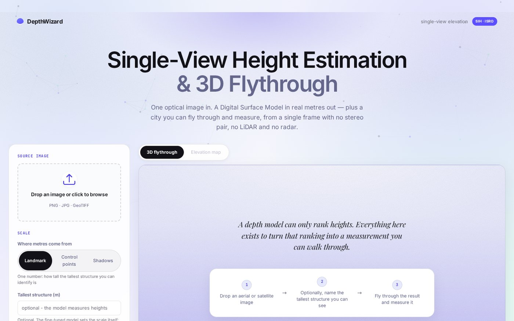
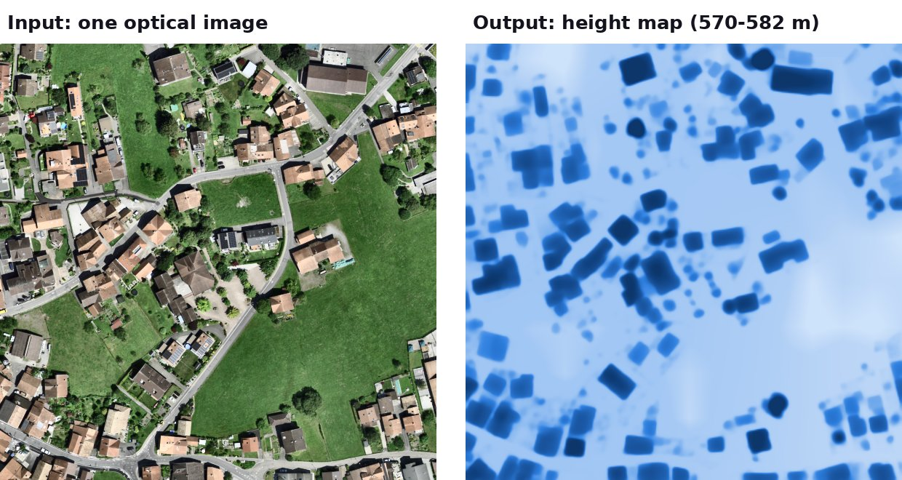
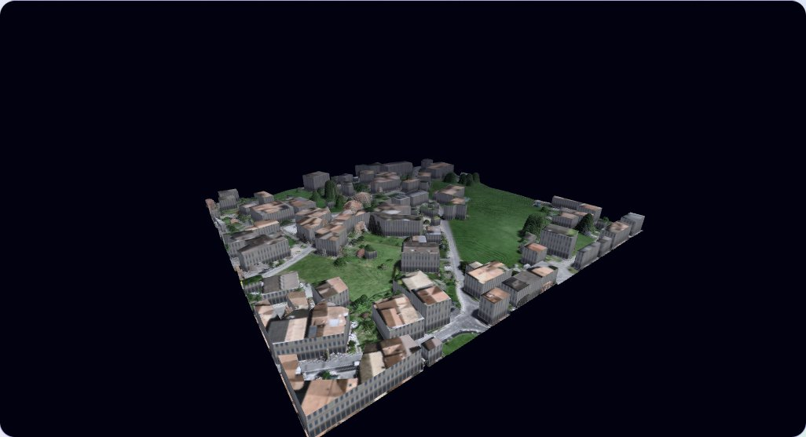
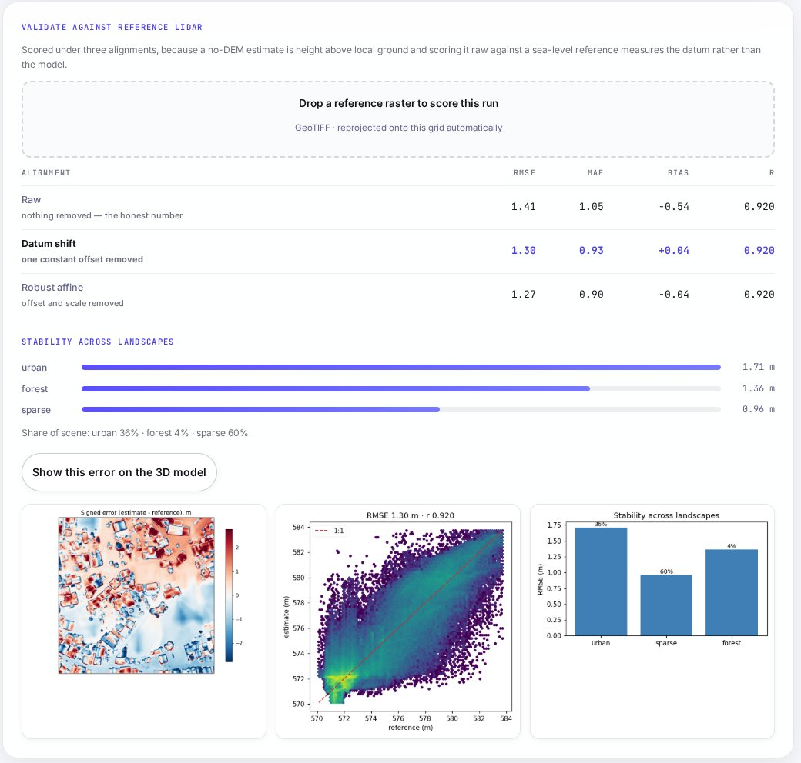

# 
 DepthWizard

<h2 align="center">Single-View Height Estimation and 3D Flythrough from One Optical Image</h2>

<h2 align="center">TEAM ALGOHOLIC1 : Smart India Hackathon 2026 (SIH 2026) 🌟</h2>

<h2 align="center">COMPLETE DESCRIPTION</h2>

### PS ID : SIH26175

### Team ID : 175991

### Organisation : Indian Space Research Organisation (ISRO), Department of Space

### Theme : Disaster Management

### Category : Software

### PS Title :
Single-View Height Estimation and 3D Flythrough

### PS Description :
Develop an end-to-end software pipeline that transforms single-view optical RGB remote-sensing images into high-precision elevation maps, for both non-georeferenced and georeferenced imagery:
1. Non-Georeferenced RGB Imagery (PNG / JPG): Produce a Relative Digital Surface Model (rDSM).
2. Georeferenced RGB Imagery (GeoTIFF): Produce an Absolute Digital Surface Model (DSM) with metric height values.
3. Elevation Extraction: Use a pre-trained monocular depth model to extract structure from single-view optical imagery.
4. Scale Calibration: Convert relative depth to absolute height using a low-resolution DEM (e.g. SRTM 30 m), scene statistics, semantic priors or a few Ground Control Points.
5. Visualization Layer: Project the optical image onto a 3D terrain mesh in a rendering engine (Unity / Three.js / Babylon.js) with first-person navigation and analysis of heights and slopes.
6. Validation: Measure RMSE, MAE and correlation against LiDAR across urban, sparse, hilly and forested landscapes, and deploy as a standalone application.

### Idea Title :
DepthWizard, a single-image 3D elevation platform that turns one optical image into a measurable, navigable 3D city.

### Idea Description :
A depth model can only rank heights: it says "this roof is higher than that street", never "this roof is 31 m". DepthWizard turns that ranking into metres, and then into a 3D city you can fly through.
1. Fine-tuned AI: Depth Anything V2, fine-tuned on the GAMUS dataset and Dutch/Swiss LiDAR (HeightNet), so it understands top-down imagery.
2. Tilt-free rotation ensemble: the image is predicted at 0°, 90°, 180° and 270° and averaged. This cancels the model's fake slope and gives a free per-pixel confidence map.
3. Scalable calibration: relative depth becomes metres from a learned scene prior, a known height, Ground Control Points, shadow lengths or the GHSL building-height grid.
4. Terrain fusion: Copernicus GLO-30 DEM supplies the ground, the image supplies buildings and trees, giving heights in metres above sea level.
5. 3D city: buildings extruded with flat roofs and vertical walls, textured with the original image and exported as glTF.
6. Measured, not claimed: built-in RMSE, MAE and correlation against LiDAR, split by landscape type.

### Abstract/ Summary :
Accurate elevation data is essential for urban planning, disaster response and defence, but LiDAR flights, stereo pairs and InSAR need special sensors, cost a lot and take days to weeks. Single-image depth models are cheap and fast, but they are trained on street photos, only rank heights and never give metres.
DepthWizard closes that gap. It takes one optical satellite or aerial image, predicts depth with a fine-tuned model, converts it to metres, fuses it with a global terrain model, and builds a 3D city you can fly or walk through, measure, and validate against LiDAR, on an ordinary laptop CPU and offline after the first run.

### Status :
We have implemented these features:
1. PNG / JPG → Relative DSM, and GeoTIFF → Absolute DSM, DTM and nDSM, exported as georeferenced GeoTIFFs.
2. Four engines: zero-shot, fine-tuned, direct metric, and the default hybrid that fuses them.
3. React + three.js viewer with fly, walk (1:1 scale) and VR modes, click-to-measure heights, slopes and elevation profiles, and height / slope / uncertainty layers.
4. FastAPI backend with background jobs, live progress, downloads and a LiDAR validation panel.
5. Runs on a laptop CPU, works offline after the first run, and ships as one Docker container.
6. Accuracy measured on 9 LiDAR scenes (AHN4 Netherlands + swissSURFACE3D Switzerland, 0.5 m), with no training tile within 3 km of a test scene:

| Engine | RMSE (raw) | MAE | Correlation r | Urban | Sparse | Hilly | Forest |
|---|--:|--:|--:|--:|--:|--:|--:|
| Zero-shot Depth Anything V2 + one known height | 5.37 m | 3.45 m | 0.78 | 6.20 | 3.73 | 4.41 | 7.55 |
| **DepthWizard hybrid, fully automatic** | **4.91 m** | **2.49 m** | **0.84** | 5.06 | 4.08 | 3.20 | 6.18 |

**Example: Interlaken, Switzerland** (swisstopo imagery, 300 m × 300 m at 0.5 m, fully automatic, no height typed in)

| 3D Flythrough | Height Layer |
|---|---|
|  |  |

Checked against swissSURFACE3D LiDAR inside the app: **RMSE 1.41 m, MAE 1.05 m, correlation r = 0.92**, with no adjustment.

### Tech Stacks Used :
⦿ <b>AI / ML :</b>
* 
  
  
  
  
  

⦿ <b>Geospatial & 3D :</b>
* 
  
  

⦿ <b>FrontEnd :</b>
* 
  
  

⦿ <b>BackEnd :</b>
* 

⦿ <b>Deployment :</b>
* 
  

### Important URLS :
⭐️ <b>DepthWizard Live Prototype :</b> [Click Here to Open](https://depthwizard-production-09d9.up.railway.app/)

⭐️ <b>SIH Idea PPT :</b> [Click Here to View](docs/Algoholic1_26175_GarvBansal.pdf)

⭐️ <b>Youtube Video :</b> [Click Here to View](https://youtu.be/HquYqR6ITIg?si=8GHgUzxU-IZQIYHt)

⭐️ <b>Technical Documentation :</b> [Click Here to View](docs/TECHNICAL.md)

⭐️ <b>Training Guide :</b> [Click Here to View](training/TRAINING.md)

⭐️ <b>Benchmark Guide :</b> [Click Here to View](mathsandml/benchmark/BENCHMARK.md)

---

## Project Created & Maintained By

## :heart: Team Algoholic1
1. [Garv Bansal](https://github.com/garv-bansal)
2. [Arpit Parashar](https://github.com/arpitparashar06)
3. [Arpit Jain](https://github.com/arpitjain0214-pixel)
4. [Bhavdeep Singh](https://github.com/Bit-wise-Bhavi)
5. [Devanshi Yadav](https://github.com/Devanshi-Yadav20)
6. [Manya Tyagi](https://github.com/manyaaaa-11)

### Hire Us

### How-to-run

- Download Python 3.10+ from the Official website [link](https://www.python.org/downloads/) (if not installed)
- Clone this Repository.
- Double-click `start.command` on macOS, `start.bat` on Windows, or run `./start.sh` on Linux.
- The first run sets everything up and downloads the depth model once. After that it starts in seconds and opens http://127.0.0.1:8000.
- Or run with Docker: `docker build -t depthwizard .` then `docker run -p 8000:8000 depthwizard`.
- Optional: put a free [OpenTopography](https://portal.opentopography.org/) key in `.env` as `OPENTOPO_KEY=...` to get heights in metres above sea level.
- Or you can directly use our application by accessing this website [link](https://depthwizard-production-09d9.up.railway.app/).

### References
1. Yang et al., "Depth Anything V2," NeurIPS 2024. [Link](https://arxiv.org/abs/2406.09414)
2. Xiong et al., "GAMUS: A Geometry-aware Multi-modal Semantic Segmentation Benchmark for Remote Sensing Data," arXiv 2023. [Link](https://arxiv.org/abs/2305.14914)
3. Chen et al., "HTC-DC Net: Monocular Height Estimation from Single Remote Sensing Images," IEEE TGRS 2023. [Link](https://doi.org/10.1109/TGRS.2023.3321255)
4. Mou & Zhu, "IM2HEIGHT: Height Estimation from Single Monocular Imagery," 2018. [Link](https://arxiv.org/abs/1802.10249)
5. He, Sun & Tang, "Guided Image Filtering," IEEE TPAMI 2013. [Link](https://ieeexplore.ieee.org/document/6319316)

Example imagery and reference LiDAR: © swisstopo (SWISSIMAGE, swissSURFACE3D), open government data.
Demo imagery: 'sadanand' by hareesh via [OpenAerialMap](https://openaerialmap.org/), CC-BY 4.0.

## Support

💙 If you like this project, give it a '⭐' and share it with your friends!
You are free to send us PRs and issues, We'd love to help and improve this.

<h1 align="center">🙏 THANK YOU 🙏</h1>

